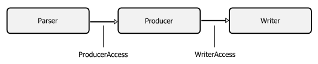
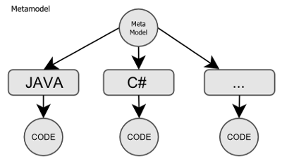
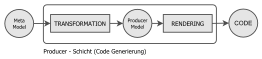

Code generator tools
====================

[](https://travis-ci.org/sergej-samsonow/code-generator)

Bunch of tools for code generation.
Fill free to translate this readme into english language

## Was ist das?
Das ist eine Kollektion von Werkzeugen für die Generierung von Programm Code.
Das ganze wurde dafür entworfen um eine „Metamodel“ - Datenstruktur 
Beschreibung wie z.B. 

```
Person
firstName : String
lastName : String
age : Integer
```
in eine konkrete Programmier-Sprache wie z.B. Java oder PHP zu übersetzen 
und dabei eine Menge Tipparbeit zu sparen.  

## Installation
Wird benötigt maven 3.+ und jdk 8. Testen Sie die installation mit mvn -version und javac -version.
Download release 1.1 entpacken Sie Archive wechseln sie in erstes Verzeichnis mit pom.xml und 
führen Sie mvn install aus.

## Komponente:
* [code-generator-api](api) - Entwicklungs API
* [code-generator-simple-parser](simple-parser) - Beispiel Parser implementierung.
* [code-generator-pojo-producer](pojo-producer) - Plain old java objects code generator.
* [code-generator-utilities](utilities) - Komponente die von den generierten Klassen benötigt werden.

## Architektur
Aktuelle Architektur besteht in wesentlichen aus 3 folgenden Schichten



##### Parser
Extrahiert Metamodel und übergibt diese an Producerschicht.

##### Metamodel
Metamodel ist ein neutrale Repräsentation von einen "Information System"
dessen Programmcode erstellt werden soll. Metamodel kann "direkt erstellt"
werden oder durch einen Parservorgang aus anderen Quelle geparst werden.



##### Producer
Producer ist eine Systemschicht welches für Programmcode Generierung zuständig
ist. Producer nimmt eine Metamodel entgegen, dann wird Anhang von Metamodel
eine Producermodel erstellt, basierend auf diesen Producermodel wird
anschließend die Programmcode erstellt. Producer ist NICHT an eine Sprache
gebunden es kann zum Beispiel für eine Sprache mehrere unterschiedliche
Producer geben, genau so ist ein Producer welches Programmcode gleich für
mehrere Sprachen erstellt -- ein absolut legitimes Konstrukt. Producer
ist einzig und allein an ein Metamodel gebunden, man kann aber beliebig 
viele Metamodels erstellen. 
Abgesehen von Programmcode wird von Producerschicht noch Teilpfad erstellt.


##### Writer
Ist die letzte Schicht und ist für die Ausgabe von generierten Programmcode
verantwortlich (Standardausgabe oder Dateisystem)


