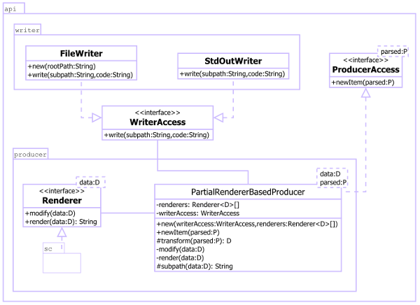
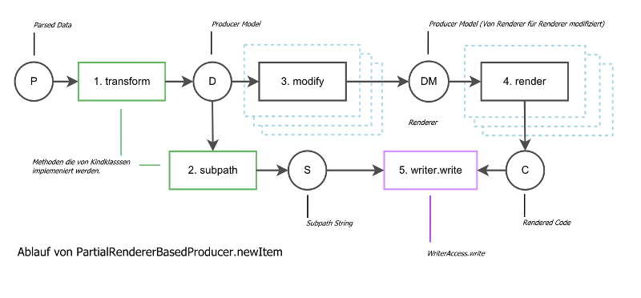
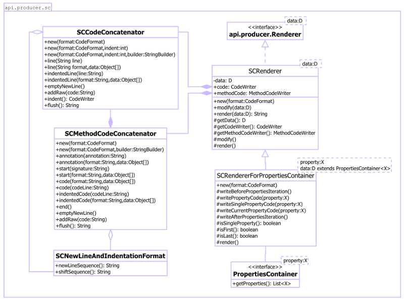

API Übersicht
=============
Haupt Schnittstellen sind [ProducerAccess][1] und [WriterAccess][2] diese
Klassen zusammen mit Parser Model (weiter und unter beschrieben) stellen die
Haupt API Schnittstelle da.



## WriterAccess
Für WriterAccess werden zwei Implementierungen bereitgestellt [FileWriter][3]
und [StdOutWriter][4].  Producer Paket stellt eine weitere Schnittstelle
[Renderer][5] bereit.

## Parser Model
Aktuell verfügbares Parsermodel wird durch [ParsedBean][13] 
und [ParsedProperty][14] abgebildet. Klassen [SimpleParsedBean][15] und
[SimpleParsedProperty][16] stellen die default Implementierung von ParsedBean und
ParsedProperty Interfaces.

## ExtendedBeanDecorator
Ab und an muss man die von code-generator erstellten Klassen weitere Business 
Methoden hinzufügen. Um dies zu ermöglichen wurde [ExtendedBeanDecorator][17]
erstellt es bittet die Möglichkeit generiertes Bean umzubenennen 
(an Beanname wird "Base" Suffix angehängt). Wir haben zum Beispiel folgende 
Metamodel:

```
    Namspace: frontend

    Person
    age  : Integer
    name : String
```

Nun stellen wir uns vor wir brauchen irgend welche Business Methoden die wir
auf Person Instanz anhängen wollen, gleichzeitig aber die Person Standard
Programmcode weiterhin generieren möchten um die Standardmethoden dafür nicht
manuell schreiben zu müssen. Um dies zu bewerkstelligen gehen wir so vor: 
Wir erstellen Instanz von ExtendedBeanDecorator an diesen Dekorator übergeben wir
(abgesehen von Producer) eine Liste mit Typen die wir umbenennen möchten in unseren 
Fall „frontend.Person“ (Umbenennungstyp wird aus Namespace und Type Name erstellt).
Bei Programmcodegenerierung wird nun PersonBase satt Person Klasse erstellt. Nachdem
Programmcode generiert wurde können wir ganz einfach die Person Klasse mit unseren
Businessmethoden anlegen, Um Standardmethoden zu nutzen wird Person Klasse von
PersonBase Klasse abgeleitet. 

## PartialRendererBasedProducer
[PartialRendererBasedProducer][6] arbeitet mit eine Liste von "Renderer" um 
Codegenerierung zu bewältigen (z.B. Renderer für Setter Methoden). Die  Ausgaben
von einzelnen "Renderer" werden dabei zu eine Gesamtausgabe zusammengefügt.
Die überschreibende Klasse muss lediglich die Methoden transform und subpath
bereitstellen.

* ```transform(P parsed) : D``` - Wandelt von Parser kommendes Model in eine 
Producer Model.
* ```subpath(D data) : String``` - Generiert Teilpfad String (wo befindet sich
die Datei) Teilpfad ist dabei relativ.



## SC – Renderer
Abkürzung sc steht für "string concateneator" was wiederum "die Art zu rendern"
impliziet es handelt sich also um ein Rendering System.



##### SCCodeConcatenator und SCMethodCodeCooncatenator
[SCCodeConcatenator][7] und [SCMethodCodeCooncatenator][8] sind sozusagen "StringBuilder"
die auf Generierung von Programmcode angepasst wurden. 

In wesentlichen vereinfachen diese Klassen Arbeit mit Einrückungen und
Zeilenumbrüchen in bei Generierung von Programmcode außerdem stellen
alle String Erzeugung Methoden eine Variante in Form von 
"String template, Object ... data" da wo man eine Zeichenkette und 
eine Reihe von Daten weiter an String.format übergeben kann.

Methoden für die Programmcode Erzeugung:

```line, indentedLine, annotation, start, code, indentedCode, end, emptyNewLine,
addRaw```

Besondere Methoden sind:

* ```indent() : void``` - Erzeugt eine neu Instance SCCodeConcatenator mit eine 
Einrückung mehr relativ zu erzeugenden Instance.
* ```flush() : String``` - Gibt aktuellen buffer zurück und leert es gleichzeitig.


##### SCNewLineAndIndentationFormat
[SCNewLineAndIndentationFormat][9] ist eine Klasse welches die Art und Weise 
regelt wie Programmcode eingerückt wird und welche Zeichenkette als newline
verwendet werden soll.


##### SCRenderer
[SCRenderer][10] ist eine Basis Implementierung von [Renderer][5] Interface das intern
[SCCodeConcatenator][7] und [SCMethodCodeConcatenator][8] nutzt. Um diese Klasse
zu nutzen muss man die Methoden modify() und render() überschreiben
(man kann beide oder nur eine davon überschreiben je nachdem was man gerade
braucht).  Ausserdem stellt diese Klasse die "code writer" (SCCodeConcatenator
und SCMethodCodeCooncatenator) und mit getData() stellt es Zugriff auf die Daten
bereit.

Die von SCRenderer erzeugten Instanzen von SCCodeConcatenator und 
SCMethodCodeCooncatenator nutzen die gleiche Instanz von StringBuilder die 
können also beide gleichzeitig genutzt werden.

Die flush() Methode von SCCodeConcatenator und SCMethodCodeCooncatenator
wird im SCRenderer am Ende der render(D data) Methode aufgerufen und
sollte in abgeleiteten Klassen nicht aufgerufen werden.


##### SCRendererForPropertiesContainer und ProprertiesContainer
[SCRendererForPropertiesContainer][11] und [PropertiesContainer][12] stellen eine 
Erweiterung von [SCRenderer][10] an und sind speziel für die Models zugeschnitten
welches ein Liste mit Propertiese besitzt. Um dieses Helfer nutzen zu können
muss an den Renderer übergebendes Model PropertiesContainer Interface
implementieren danach kann kann man bei Bedarf die folgenden 3 Methoden
überschreiben

* ```writeCodeBeforPropertiesIteration() : void``` 
* ```writePropertyCode(X property) : void```
* ```writeCodeAfterProprertiesIteration() : void```

Alternativ kann man folgende Methoden überschreiben und die voreingestellte
Logic in writePropertyCode(X property) : void nutzen. Voreinstellung ist
Sofern nur ein einziges Property Eintrag in der List der Properties vorhanden
ist so wird die Method writeSinglePropertyCode aufgeruffen sonst wird
bei jeder Iteration die methode writeCurrentPropertyCode aufgerufen.

* ```writeCodeBeforPropertiesIteration() : void``` 
* ```writeSinglePropertyCode(X property) : void```
* ```writeCurrentPropertyCode(X property) : void```
* ```writeCodeAfterProprertiesIteration() : void```

Zusätzlich zu den oben gennanten Methoden stellt Object noch folgende
methoden zu Verfügung

* ```isSingleProperty() : boolean``` 
* ```isFirst() : boolean```
* ```isLast() : boolean```

Über diese Methoden kann man herausfinden welche Listen Element (Property)
man gerade vor sich hat isFirst - erstes, isLast - letztes und isSingleProperty
sagt das die Liste nur aus einen einzigen Elementen besteht.

In wesentlichen stellt SCRendererForPropertiesContainer eine Methode für die
Iterateion über Properties Liste da.

[1]: src/main/java/com/github/sergejsamsonow/codegenerator/api/ProducerAccess.java
[2]: src/main/java/com/github/sergejsamsonow/codegenerator/api/WriterAccess.java
[3]: src/main/java/com/github/sergejsamsonow/codegenerator/api/writer/FileWriter.java
[4]: src/main/java/com/github/sergejsamsonow/codegenerator/api/writer/StdOutWriter.java
[5]: src/main/java/com/github/sergejsamsonow/codegenerator/api/producer/Renderer.java
[6]: src/main/java/com/github/sergejsamsonow/codegenerator/api/producer/PartialRendererBasedProducer.java
[7]: src/main/java/com/github/sergejsamsonow/codegenerator/api/producer/sc/SCCodeConcatenator.java
[8]: src/main/java/com/github/sergejsamsonow/codegenerator/api/producer/sc/SCMethodCodeConcatenator.java
[9]: src/main/java/com/github/sergejsamsonow/codegenerator/api/producer/sc/SCNewLineAndIndentationFormat.java
[10]: src/main/java/com/github/sergejsamsonow/codegenerator/api/producer/sc/SCRenderer.java
[11]: src/main/java/com/github/sergejsamsonow/codegenerator/api/producer/sc/SCRendererForPropertiesContainer.java
[12]: src/main/java/com/github/sergejsamsonow/codegenerator/api/producer/sc/PropertiesContainer.java
[13]: src/main/java/com/github/sergejsamsonow/codegenerator/api/parser/model/ParsedBean.java
[14]: src/main/java/com/github/sergejsamsonow/codegenerator/api/parser/model/ParsedProperty.java
[15]: src/main/java/com/github/sergejsamsonow/codegenerator/api/parser/model/SimpleParsedBean.java
[16]: src/main/java/com/github/sergejsamsonow/codegenerator/api/parser/model/SimpleParsedProperty.java
[17]: src/main/java/com/github/sergejsamsonow/codegenerator/api/parser/ExtendedBeanDecorator.java
