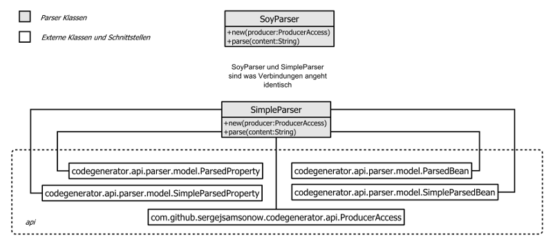

Parser Komponenten
==================

Klassenübersicht


##### SimpleParser
Einfaches Parser Beispiel parst Daten in ein Metamodel welches von den Producer 
weiterverarbeitet wird. Beispiel Eingabe Datei für diesen Parser kann man [hier][1] 
anschauen.

##### SoyParser
Parser für Extraktion von Informationen aus Google Closure Templates Dateien.
Beispiel:
```
    {namespace page}

    /**
     * Soy Documentation for Template.
     * @param message 
     * 
     * Bean : Person extends Entry
     * @param age  : Integer
     * @param name : String
     */
```
Damit Parser funktionieren kann muss ein Marker ``Bean : `` in Template 
Beschreibung enthalten sein in oberen Beispiel werden folgene Informationen
extrahiert:

1. Namespace page
2. Metatype Person welches von Entry abgeleitet wird beide liegen in Namespace page
3. Person Integer Property age
4. Person Integer Property name

Parameter message wird nicht als Teil des Metatype angesehen es werden nur 
Informationen nach dem Marker ``Bean : `` ausgewertet. Momentan wird ein Bean 
pro Template Beschreibung extrahiert es wurde nicht getestet was passiert 
wenn eine Beschreibung mehrere Bean Deklarationen enthalten sind.


## ExtendedBeanDecorator
Ab und an muss man die von code-generator erstellten Klassen weitere Business 
Methoden hinzufügen. Um dies zu ermöglichen wurde [ExtendedBeanDecorator][2] es
bittet die Möglichkeit generiertes Bean umzubenennen (an Beanname wird "Base" 
Suffix angehängt). Wir haben zum Beispiel folgende Metamodel:

```
    Namspace: frontend

    Person
    age  : Integer
    name : String
```

Nun stellen wir uns vor wir brauchen irgend welche Business Methoden die wir
auf Person Instanz  anhängen wollen, gleichzeitig aber die Person Standard
Programmcode weiterhin generieren möchten um die Standardmethoden dafür nicht
manuell schreiben zu müssen. Um dies zu bewerkstelligen gehen wir so vor: 
Wir erstellen Instanz von ExtendedBeanDecorator an diesen Dekorator übergeben wir
(abgesehen von Producer) eine Liste mit Typen die wir umbenennen möchten in unseren 
Fall „frontend.Person“ (Umbenennungstyp wird aus Namespace und Type Name erstellt).
Bei Programmcodegenerierung wird nun PersonBase satt Person Klasse erstellt. Nachdem
Programmcode generiert wurde können wir ganz einfach die Person Klasse mit unseren
Businessmethoden anlegen, Um Standardmethoden zu nutzen wird Person Klasse von
PersonBase
Klasse abgeleitet. 

[1]: src/test/resources/simple-parser-input.txt
[2]: src/main/java/com/github/sergejsamsonow/codegenerator/parser/ExtendedBeanDecorator.java
