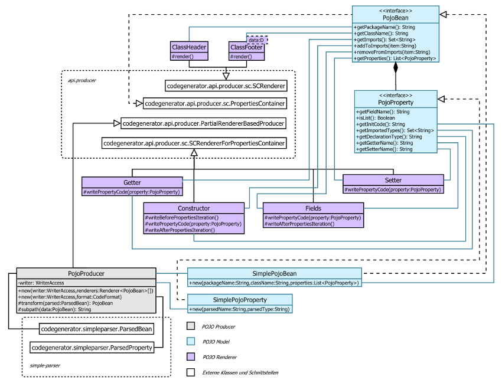

POJO Producer Übersicht
=======================
POJO steht für "plain old java object" ist also Generator für einfache Java Klassen.
Um zu verstehen wie das funktioniert schaut man sich am besten [Integration Test][1] 
und die [erwartete Ausgabe][2] dazu. Es folgt nun die Klassen Übersicht.



## Renderer
Beispiele von Renderer generierten Programmcode.

##### ClassHeader
```
Form extends Widget
suggest     : String
attributes  : List<page.Attribute>
```
```java
import java.util.List;
import java.util.ArrayList;
import page.Attribute;
public class Form extends Widget {
```
(Imports können abweichen)

##### Constructor
```
Form
content : String
frame : page.Frame
messages : List<Message>
```
```java
    public Form() {
        setContent("");
        setFrame(new Frame());
        setMessages(new ArrayList<>());
    }

```

##### Fields
```
content : String
```
```java
    private String content;

```

##### Getter
```
content : String
```
```java
    getContent() {
        return content;
    }

```

##### Setter
```
content     : String
attributes  : List<page.Attribute>
```
```java
    setContent(String content) {
        this.content = content;
    }

    setAttributes(List<Attribute> attributes) {
        this.attributes = attributes;
    }

```

##### ClassFooter
Erstellt schließende Classklammer.
```java
}

```

##### MapSerializerToMap
Serialization von Objekt Inhalt zu Map<String, Object>.
**Wichtig** wenn man diesen Renderer verwendet dann muss man
```java
com.github.sergejsamsonow.codegenerator.utilities.MapSerilaizer
```
Interface für generierten Code bereitstellen.

```
name : String
address : Address
numbers : List<Integer>
persons : List<Person>
```
```java
    @Override
    public Map<String, Object> toMap() {
        Map<String, Object> resultMap = new HashMap<>();
        resultMap.put("name", getName());
        resultMap.put("address", getAddress().toMap());
        resultMap.put("numbers", getNumbers());
        List<Map<String, Object>> personsList = new ArrayList<>();
        getPersons().stream().forEach(current -> personsList.add(current.toMap()));
        resultMap.put("persons", personsList);
        return resultMap;
    }

```

##### MapSerializerFromMap
Serialization von Objekt Inhalt zu Map<String, Object>.
**Wichtig** wenn man diesen Renderer verwendet dann muss man 
```java
import com.github.sergejsamsonow.codegenerator.utilities.MapSerilaizer
import com.github.sergejsamsonow.codegenerator.utilities.MapAccess
```
Interface und Class für generierten Code bereitstellen.

```
name : String
address : Address
numbers : List<Integer>
persons : List<Person>
```
```java
    @Override
    public void fromMap(Map<String, Object> map) {
        MapAccess mapAccess = new MapAccess(map);
        setName(mapAccess.getString("name"));
        Address address = new Address();
        address.fromMap(mapAccess.getMap("address"));
        setAddress(address);
        setNumbers(mapAccess.getIntegerList("numbers"));
        List<Person> personsList = new ArrayList<>();
        for (Map<String, Object> current : mapAccess.getMapList("persons")) {
            Person personsItem = new Person();
            personsItem.fromMap(current);
            personsList.add(personsItem);
        }
        setPersons(personsList);
    }

```

[1]: src/test/java/com/github/sergejsamsonow/codegenerator/pojo/IntegrationPojoProducerTest.java
[2]: src/test/resources/pojo-renderer/PojoProducer-Integration.txt
