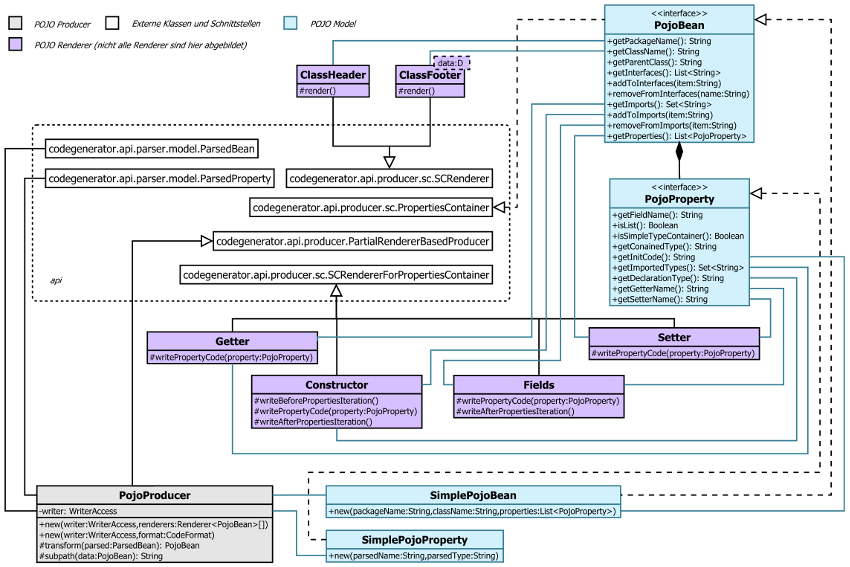

POJO Producer Übersicht
=======================
POJO steht für "plain old java object" ist also Generator für einfache Java Klassen.
Um zu verstehen wie das funktioniert schaut man sich am besten [Integration Test][1] 
und die [erwartete Ausgabe][2] dazu. Es folgt nun die Klassen Übersicht.



## Renderer
Beispiele von Renderer generierten Programmcode.

##### ClassHeader
```
Form extends Widget
suggest     : String
attributes  : List<page.Attribute>
```
```java
import java.util.List;
import java.util.ArrayList;
import page.Attribute;
public class Form extends Widget {
```
(Imports können abweichen)

##### Constructor
```
Form
content : String
frame : page.Frame
messages : List<Message>
```
```java
    public Form() {
        setContent("");
        setFrame(new Frame());
        setMessages(new ArrayList<>());
    }

```

##### Fields
```
content : String
```
```java
    private String content;

```

##### Getter
```
content : String
```
```java
    getContent() {
        return content;
    }

```

##### Setter
```
content     : String
attributes  : List<page.Attribute>
```
```java
    setContent(String content) {
        this.content = content;
    }

    setAttributes(List<Attribute> attributes) {
        this.attributes = attributes;
    }

```

##### ClassFooter
Erstellt schließende Classklammer.
```java
}

```

[1]: src/test/java/com/github/sergejsamsonow/codegenerator/pojo/IntegrationPojoProducerTest.java
[2]: src/test/resources/pojo-renderer/PojoProducer-Integration.txt
