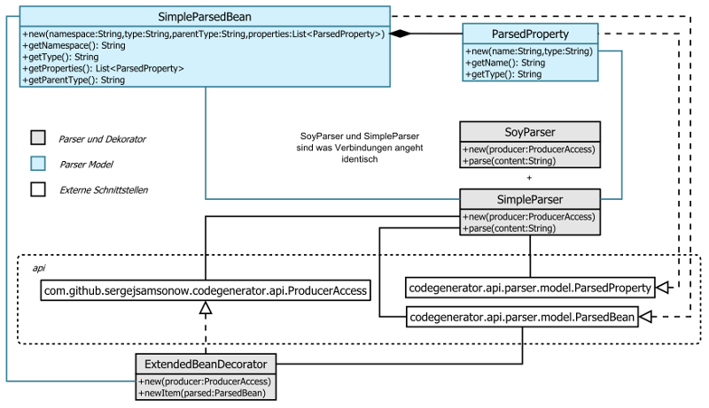

Simple Parser Übersicht
=======================
Einfaches Parser Beispiel parst Daten in ein Metamodel welches von den Producer 
weiterverarbeitet wird. Beispiel Eingabe Datei für diesen Parser kann man [hier][1] 
anschauen. Es folgt nun die Klassen Übersicht.

[1]: src/test/resources/simple-parser-input.txt